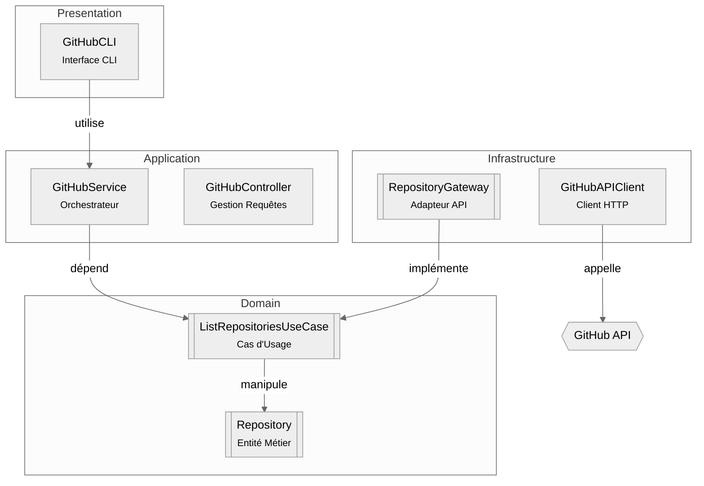

# GitHub Library - Clean Architecture C++

## Architecture Overview


Notre solution implémente une architecture hexagonale moderne avec 4 couches clés :

### 1. **Domain Layer (Core)**
**Responsabilité** : Logique métier fondamentale  
```cpp
// Exemple d'entité
class Repository {
    std::string name;
    std::string url;
    bool isPrivate;
};
```
- **Entities** : 
  - `Repository.hpp` - Représentation pure des données GitHub
- **Use Cases** :
  - `ListRepositoriesUseCase.hpp` - Cas d'utilisation principal

- **Interfaces** :
  - `IRepositoryGateway.hpp` - Contrat pour l'accès aux données

### 2. **Application Layer (Orchestration)**
**Responsabilité** : Coordination des flux métier  
```cpp
class GitHubService {
    IRepositoryGateway& gateway;
public:
    std::vector<Repository> listRepositories() {
        return gateway.fetchAll();
    }
};
```
- **Services** :
  - `GitHubService.hpp` - Point d'entrée principal

### 3. **Infrastructure Layer (Implementation)**
**Responsabilité** : Détails techniques concrets  
```cpp
class GitHubAPIClient : public IRepositoryGateway {
    std::string authToken;
public:
    std::vector<Repository> fetchAll() override {
        // Implémentation HTTP réelle
    }
};
```
- **Clients** :
  - `GitHubAPIClient.hpp` - Implémentation REST/GraphQL
- **Gateways** :
  - `RepositoryGateway.hpp` - Adaptateur API→Domain
- **Utilitaires** :
  - `Logger.hpp` - Logging structuré

### 4. **Presentation Layer (I/O)**
**Responsabilité** : Interaction utilisateur  
```cpp
class GitHubCLI {
    GitHubService& service;
public:
    void displayRepositories() {
        auto repos = service.listRepositories();
        // Affichage formaté
    }
};
```
- **CLI** :
  - `GitHubCLI.hpp` - Interface ligne de commande

---
## Structure du Projet
GitHubAPi
.
|
├──include
│   ├── application
│   │   ├── controllers
│   │   │   └── GithubController.hpp
│   │   └── services
│   │       └── GitHubService.hpp
│   ├── domain
│   │   ├── entities
│   │   │   └── Repository.hpp
│   │   ├── interfaces
│   │   │   ├── IGitHubService.hpp
│   │   │   └── IRepositoryGateway.hpp
│   │   └── use_cases
│   │       ├── CreateRepository.hpp
│   │       ├── DeleteRepository.hpp
│   │       └── ListRepositories.hpp
│   ├── infrastructure
│   │   ├── clients
│   │   │   └── GitHubAPIClient.hpp
│   │   ├── gateways
│   │   │   └── RepositoryGateway.hpp
│   │   └── logging
│   │       └── Logger.hpp
│   └── presentation
│       └── cli
│           └── GitHubCLI.hpp
├── src
│   ├── application
│   │   ├── controllers
│   │   │   └── GithubController.cpp
│   │   └── services
│   │       └── GithubService.cpp
│   ├── domain
│   │   ├── interfaces
│   │   └── use_cases
│   │       ├── CreateRepository.cpp
│   │       ├── DeleteRepository.cpp
│   │       └── ListRepository.cpp
│   ├── infrastructure
│   │   ├── clients
│   │   │   └── GithubAPIClient.cpp
│   │   ├── gateways
│   │   │   └── RepositoryGateway.cpp
│   │   └── logging
│   │       └── Logger.cpp
│   ├── main.cpp
│   └── presentation
│       └── GitHubCLI.cpp
---
## Getting Started

### 1. Dépendances
```bash
# Installation des dépendances
sudo apt-get install -y libcurl4-openssl-dev nlohmann-json3-dev
```

### 2. Intégration CMake
```cmake
add_subdirectory(github_lib)

target_link_libraries(your_target PRIVATE
    GitHub::Core
    GitHub::Infrastructure
)
```

### 3. Utilisation de Base
```cpp
#include <infrastructure/clients/GitHubAPIClient.hpp>
#include <application/services/GitHubService.hpp>

int main() {
    // Configuration
    GitHubAPIClient client("ghp_your_token_here");
    GitHubService service(client);
    
    // Liste des repositories
    const auto repositories = service.listRepositories();
    
    // Création repository (TODO)
    // service.createRepository("new-repo", "Initial version");
    
    return EXIT_SUCCESS;
}
```

---
## API Reference

### GitHubService
| Méthode                 | Paramètres                      | Retour          |
|-------------------------|---------------------------------|-----------------|
| `listRepositories()`    | -                              | `vector<Repo>` |


### GitHubAPIClient
```cpp
// Configuration avancée
client.setTimeout(5000); // ms
client.enableCaching(true);
client.setAPIVersion("2022-11-28"); // Version API GitHub
```

---
## Roadmap

- [ ] Implémenter l'authentification OAuth
- [ ] Ajouter le support GraphQL
- [ ] Compléter les tests d'intégration
- [ ] Publier le package Conan

---